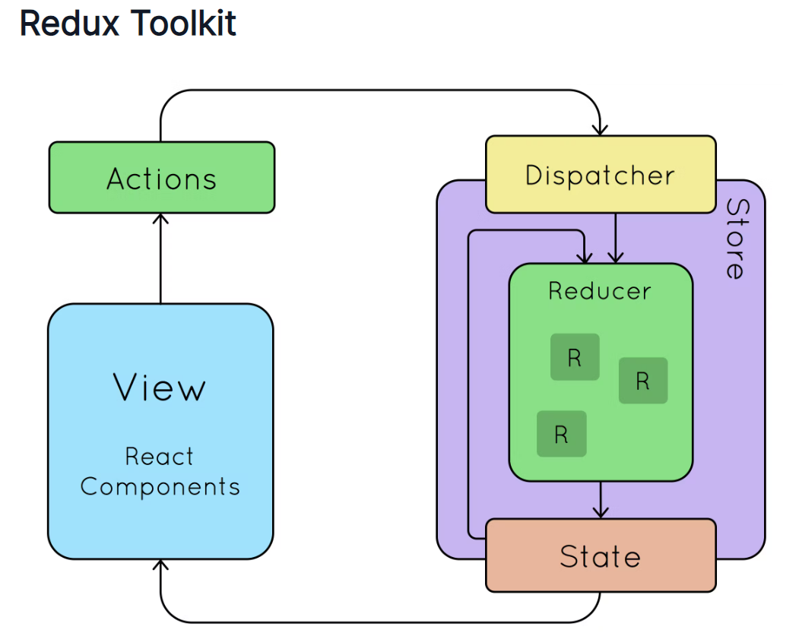
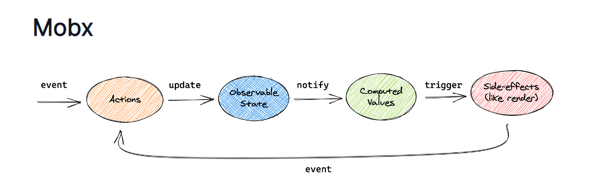

# __State Sharing__

# Central Store of Data
Generally to avoid prop drilling we are using a central store for data. `Redux` and `Mobx` are mostly used for this purpose.

- In Mobx there is more then one store for data storage. In Redux, there is only one large store.
- Mobx is mainly used for small and simple applictions but you can also use for large applications. Redux is not suggestable for small applications. It is mostly used for large and complex applications.
- Mobx gives good performance as compared to Redux in some cases.
- In Mobx, the states can be overwritten, which also referred to as an impure state because the state can be updated simply with the new values. In Redux, the state is referred to as a pure state as states are read-only and cannot be overwritten simply. It means it uses an immutable state.
- Mobx is easier to learn and has a simple learning curve. Redux is difficult to learn, as it has a steep learning curve.
- Mobx has less online community and developer support as compared to Redux.
- Mobx is mainly preferred to use for beginners as it is simple and easy to learn. Redux can be preferred for those who have a strong understanding of functional programming skills.

Redux Toolkit

Mobx

- state : State is the data that drives our application. The data can be of any type like, string, array or object. Just make sure to mark them observable which you want to change over time.
- action : Actions are anything that modify the state.

__Mobx Store__
<a href="https://snack.expo.dev/@subrat1977/mobxcounterapp"><u>View in Snack</u></a>

    // store.js
    import {makeAutoObservable, runInAction} from 'mobx';

    class MyStore {
    counter = 10;
    user = {};

    constructor(){
        makeAutoObservable(this); 
    }
    
    increment(){
        console.log("before: ",this.counter);
        runInAction(()=>{
        this.counter = this.counter + 1;
        })
        console.log("after: ",this.counter);
    }

    decrement(){
        runInAction(()=>{
        this.counter = this.counter - 1;
        })
    }

    getUser(){
        fetch('https://jsonplaceholder.typicode.com/users/1')
        .then(response => response.json())
        .then(json => {
            runInAction(()=>{
            this.user = json
            })
        })
    }
    }

    export default store = new MyStore();
---
    // Button.js
    import {TouchableOpacity, Text, StyleSheet} from 'react-native';

    const Button = ({title, onPress, style}) => {
    return(<TouchableOpacity onPress={onPress} style={{...styles.btn, ...style}}>
        <Text style={{textAlign:'center', color:'#FFF'}}>{title}</Text>
    </TouchableOpacity>)
    }

    export default Button;

    const styles = StyleSheet.create({
    btn : {
        backgroundColor: 'rgb(51, 51, 0)',
        borderRadius:5,
        padding:5
    }
    })
---
    // App.js
    import * as React from 'react';
    import { Text, View, StyleSheet } from 'react-native';
    import Constants from 'expo-constants';
    import Button from './Button'
    import store from './store'
    import {observer} from 'mobx-react-lite'

    function App() {
    
    return (
        <View style={styles.container}>
        <Text style={styles.paragraph}>Mobx Counter App</Text>
        <Button title={"+"} onPress={ () => store.increment()}/>
            <Text style={{textAlign:'center', margin:10}}>
                Counter Value: {store.counter}
            </Text>
        <Button title={"-"} onPress={() => store.decrement()} />
        <Text style={{textAlign:'center'}}>{store.user.name}</Text>
        <Button title={"Get User"} 
            onPress={()=> store.getUser()} 
            style={{marginTop:20}} />
        </View>
    );
    }

    export default observer(App);

    const styles = StyleSheet.create({
    container: {
        flex: 1,
        justifyContent: 'center',
        paddingTop: Constants.statusBarHeight,
        backgroundColor: '#ecf0f1',
        padding: 8,
    },
    paragraph: {
        margin: 24,
        fontSize: 18,
        fontWeight: 'bold',
        textAlign: 'center',
    },
    });
